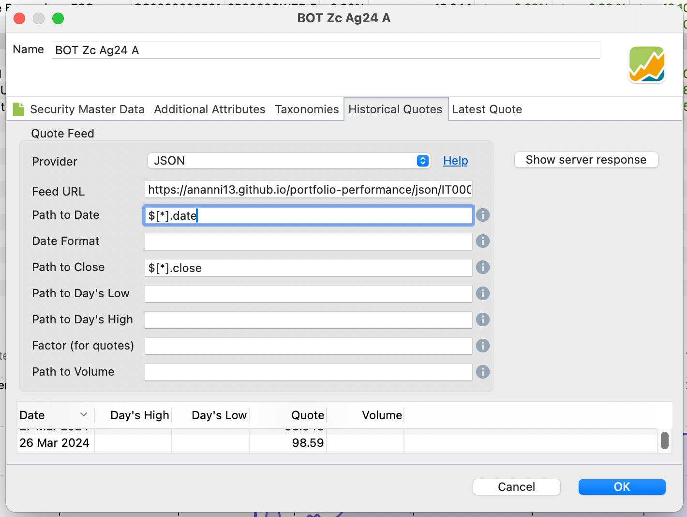

# portfolio-performance

This repository generates static JSON files with securities quotes from different sources. These quotes can be added easily in Portfolio Performance.

They are updated daily and available under the `https://ananni13.github.io/portfolio-performance/json/<ISIN>.json` URL.

Example: https://ananni13.github.io/portfolio-performance/json/IT0005532723.json

## Add a quote

If a quote is not present it needs to be added in the [`securities.csv`](./securities.csv). It needs the ISIN (with some other information depending on the loader used), a Name, and a "loader". If the loader does not exists already it needs to be implemented.

### Loaders

These are the currently available loaders:

- [Borsa Italiana](./pkg/security/loaders/borsaitaliana/borsaitaliana.go)
- [Financial Times](./pkg/security/loaders/financialtimes/financialtimes.go)
- [FondiDoc](./pkg/security/loaders/fondidoc/fondidoc.go)
- [FonTe](./pkg/security/loaders/fonte/fonte.go)
- [Morgan Stanley](./pkg/security/loaders/morganstanley/morganstanley.go)
- [SecondaPensione](./pkg/security/loaders/secondapensione/secondapensione.go)
- [CorePension](./pkg/security/loaders/corepension/corepension.go)

#### Borsa Italiana

```csv
"IT0005547408.MOT","Btp Valore Gn27 Eur","borsaitaliana"
```

The first field has to be in the format `ISIN.MARKET`.

Possible markets: `MTA`, `MOT`, `ETF`, `TLX`. Choose the appropriate one for the security.

#### Financial Times

```csv
"IE00B4L5Y983.22573329","iShares Core MSCI World UCITS ETF USD (Acc)","financialtimes"
```

The first field has to be in the format `ISIN.SYMBOL`.

#### FondiDoc

```csv
"IT0001083424.SAZINTE","Eurizon Azioni Internazionali ESG","fondidoc"
```

The first field has to be in the format `ISIN.FUNDID`.

`FUNDID` is the string found in the FondiDoc URL before the fund ISIN and name, `SAZINTE` in this example:

```
https://www.fondidoc.it/d/Index/SAZINTE/IT0001083424_eurizon-azionario-internazionale-etico
```

#### FonTe

```csv
"FP-FonTe-Dinamico.dinamico","Fondo Pensione Fon.Te. - Comparto Dinamico","fonte"
```

The first field has to be in the format `ISIN.URLNAME`.

`URLNAME` is the last string in the FonTe URL, `dinamico` in this example:

```
https://www.fondofonte.it/gestione-finanziaria/i-valori-quota-dei-comparti/comparto-dinamico/
```

#### Morgan Stanley

```csv
"LU0119620416.1209.A","Global Brands Fund A","morganstanley"
```

The first field has to be in the format `ISIN.FUNDID.SHARECLASSID`.

Finding the `FUNDID` and `SHARECLASSID` is a bit involved. First go to the fund page, in this example:

```
https://www.morganstanley.com/im/it-it/intermediary-investor/funds-and-performance/morgan-stanley-investment-funds/equity/global-brands.shareClass.A.html
```

The `SHARECLASSID` is the code between `shareClass.` and `.html` in the URL, `A` in this case.

For the `FUNDID`: right click on a blank spot in the page, select **View Page Source** (or similar, depends on your browser), a new tab will open up with the HMTL code of the page, search **fundid=** and you'll find it:

```html
<div class="bigHeader" fundId="1209"></div>
```

#### SecondaPensione

```csv
"QS0000003561","SecondaPensione Espansione ESG","secondapensione"
```

#### CorePension

```csv
"QS0000061309","CorePension Azionario Plus ESG","corepension"
```

## How To add a quote to Portfolio Performance

Add an empty instrument and add the JSON historical quotes.

To load the quotes in Portfolio Performance just add the URL of the quotes that you need with the proper JSONPath expression:

- Date: `$[*].date`
- Close: `$[*].close`


